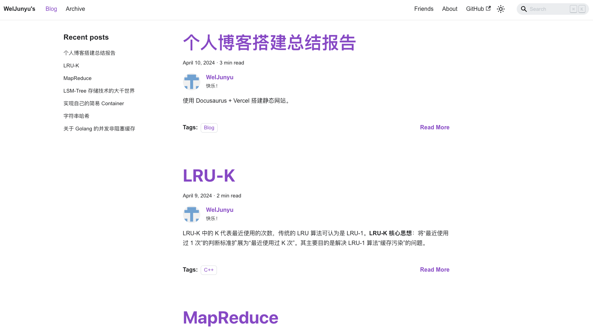

使用 Docusaurus + Vercel 搭建静态网站。

<!--truncate-->

使用 Docusaurus 的原因是，它不仅可以解析 Markdown，写作时所见即所得，而且可以使用 React 绘制前端组件，在博客中展示可交互的内容，例如 [LRU-K](/lru-k) 这篇博客中，它存在一个可交互组件。（下面的组件都可以点击）源码在：https://github.com/WelJunyu/blog/blob/main/src/components/LRUKExample.js

import LRUKExample from '../src/components/LRUKExample';

<LRUKExample/>

而 MapReduce 这篇博客开头的简介，也是 Docusaurs 本身没有的，也是自己实现的一个展示组件。源码在：https://github.com/WelJunyu/blog/blob/main/src/components/Paper.js

import Paper from '../src/components/Paper';

<Paper
 title="MapReduce: Simplified Data Processing on Large Clusters"
 authors="Jeffrey Dean and Sanjay Ghemawat"
 link="https://static.googleusercontent.com/media/research.google.com/zh-CN//archive/mapreduce-osdi04.pdf"
 abstract="MapReduce is a programming model and an associated implementation 
 for processing and generating large data sets. 
 Users specify a map function that processes a key/value pair 
 to generate a set of intermediate key/value pairs, 
 and a reduce function that merges all intermediate values associated with the same intermediate key. 
 Many real world tasks are expressible in this model, as shown in the paper......"
/>

## 页面介绍

### 1 主页

[点击进入](/)

网站的根目录，以最简洁的方式展示所有博客的摘要和介绍

### 2 博客详细页面

[点击进入](/blog-report)

虽然大体上和主页相似，但是右侧多了相应博客的标题栏

页面底部也有相邻的博客信息。

### 3 博客归档页面

[点击进入](/archive)

点击上方的 Archive 即可进入，这里会将所有博客按照时间顺序进行归档

### 4 友链

[点击进入](/friends)

可以将朋友博客的链接在这里，同时展示他们的个人信息。注意右侧展示的排名不分先后，刷新页面会同时会刷新展示顺序。这个页面也是 Docusaurus 本身不提供的，也是自己使用 React 实现的。源码在：https://github.com/WelJunyu/blog/blob/main/src/pages/friends.jsx

### 5 个人介绍

[点击进入](/about)

简单的展示个人介绍的页面

## 搭建过程

相比于 Github Pages 的搭建过程，Vercel 搭建过程就非常简单了。只需要鼠标点点，就可以完成博客的部署。

首先进入 Vercel 网站，通过 Github 注册好账号，链接 Vercel。

之后就可以通过导入仓库的方式，导入我们的博客。可以看到，Vercel 网站中已经读取了我们的 Github 仓库，点击 Import。

在这个页面，我们什么也不用做，只需要点击 Deploy 按钮，即可完成博客的部署。

一段时间后，如下图，就出现了搭建完成的图标。

在设置中可以看到，Vercel 给我们分配了一个 https 的域名，比较难记。所以我们可以对其进行更改，或是使用自己的域名。但我没有买域名，所以就用 Vercel 提供的吧。

点击 Edit 按钮，修改域名为 weijunyu-blog.vercel.app，点击 Save 按钮。如果这个域名没有冲突的话，就可以使用了。至此，博客部署完毕！访问 https://weijunyu-blog.vercel.app/ 即可访问博客。

## 总结

我感觉这种方式，比用 Jekyll、Hexo 等静态博客框架部署的更快！更简洁！可拓展性更强！可展示性、自由度更高！本身页面足够简介，可以让读者专注于阅读。使用 React 编写展示组件，也能提供比其他博客框架更强大的表现力！

## 参考资料

1. https://vercel.com/
2. https://docusaurus.io/
3. https://react.dev/