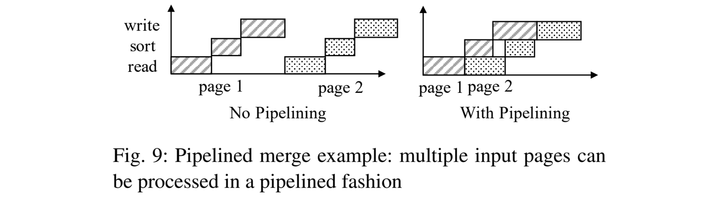

import Paper from '../src/components/Paper';

<Paper
 title="LSM-based Storage Techniques: A Survey"
 authors="Chen Luo · Michael J. Carey"
 link="https://arxiv.org/abs/1812.07527"
 abstract="Recently,
  the Log-Structured Merge-tree (LSM-tree) has been widely adopted for use
  in the storage layer of modern NoSQL systems.
  Because of this, there have been a large number of research efforts,
  from both the database community and the operating systems community,
  that try to improve various aspects of LSM-trees.
  In this paper, we provide a survey of recent research efforts on LSM-trees
  so that readers can learn the state-of-the-art in LSM-based storage techniques.
  We provide a general taxonomy to classify the literature of LSM-trees, survey the efforts in detail,
  and discuss their strengths and trade-offs.
  We further survey several representative LSM-based open-source NoSQL systems
  and discuss some potential future research directions resulting from the survey."
/>

该篇博客的主要内容是对该综述论文的理解与转述。

<!--truncate-->

## 历史 & 总所周知的事情

### In-Place Update

In-Place Update 是一种更新策略。比如 B+树，每次更新都会覆盖旧值。它内部储存的所有记录都是最新版本。可以对它进行非常多的**读优化**。

不过它牺牲了写性能，更新时会产生大量的随机 IO。而且随着更新操作和删除操作的进行，索引的 Page 内部碎片化加重（Page 写不满），导致磁盘空间利用率下降。

### Out-of-Place Update

LSM-Tree 是典型的 Out-of-Place Update 策略。每次更新写入不会覆盖旧值，而是写入到新位置。这样可以利用顺序 IO 进行**写优化**。不覆盖旧值对故障恢复也非常便利。

不过它牺牲了读性能。因为一条记录可能储存在多个位置，可能会进行多次查找过程。而且这种结构还需要额外的合并操作，以提高存储空间利用率和读取效率。

### LSM-Tree 曲折的诞生之旅

- 1976年，*Differential Files*：它所有更新先应用于一个 differential file，该文件定期与 main file 合并。
- 1980s，*Postgres*：所有写入的记录被添加到一个连续的日志中，从而实现 fast recovery 和 “time-travel” queries。它还使用一个名为 vacuum cleaner 的后台进程进行旧记录的垃圾回收。后面在文件系统上被使用，如 *Log-Structured File System (LFS)*。
- 1996年，*LSM-Tree* 横空出世！它解决了数据如何重组的问题，将 Compaction 过程集成到自身结构中。保证查询性能和空间利用率的同时仍能提供较高的写性能。

原始设计的 LSM-Tree 维护一些 Components，每一个结构都可以看成是 B+树。当其中某个 $C_i$ 填满时，会将其叶子节点合并到 $C_{i+1}$ 中。不过由于实现的复杂性，现在基于 LSM-Tree 不会采用这种 leveling merge 的策略。

LSM-Tree 原论文认为，当所有相邻层的 $T_i = \vert \frac{C_{i+1}}{C_i} \vert$ 都相同时，写性能最优！

## 现世 LSM-Tree 的根基

Jagadish 等人提出了一种结构，采用 stepped-merge 策略合并，可以达到更好的写性能。后来人们发现，使用类似的思想，将 LSM-Tree 的 Components 按层级结构组织，当 L 层中包含 T 个 Components 时，将它们全部合并到 L+1 层中，也能达到很好的写性能。后来该策略成为了主流 LSM-Tree 的 tiering-merge 策略。

现在 LSM-Tree 依然使用 Out-of-Place Update 策略减少随机 IO。LSM-Tree 内存的 Component 可以由任意一个并发数据结构实现，例如 Skip Table 和 B+树。磁盘的 Component 通常由 B+树 或 SSTable 实现。（SSTable 名为排序字符串表，包含许多数据块和一个索引块。数据块按 Key 排序的 Key-Value Pair 储存，索引块储存每个数据快 Key 的范围）

LSM-Tree 查询时按新旧顺序逐个访问 Component。随着时间的推移，查询性能会下降。此时需要逐渐合并磁盘 Component，减少磁盘 Component 的数量。对于合并策略，有 level merge 和 tiering merge 两种策略。

- level merge：将 $L_i$ 层的 Component 与 $L_{i+1}$ 层中的一起合并。
- tiering merge：将 $L_i$ 层的所有 Components 合并成一个新的 Component 添加到 $L_{i+1}$ 层中。

## 人尽皆知的优化方案

### 布隆过滤器

一种极省空间的概率数据结构，功能相当于 HashMap，但无法返回真实 Value。它能告诉你目标 Key/Value 是否**可能**存在，不过它有极小概率出现假阳性。意味着，如果 LSM-Tree 布隆过滤器返回不存在，则不需要再去磁盘中逐个查找 Components 了。使用布隆过滤器优化读性能再好不过了！！！

### 分片（Partitioning）

将磁盘上每层的 Component 拆解成更小的 Component（后续 Component 均用 SSTable 替代），每个 SSTable 更小，进行 Compaction 操作更快、耗费资源更少。

#### partitioned leveling merge

LevelDB 提出 partitioned leveling merge 策略。每层内都进行分片，并标记每个 SSTable 的范围。它不断在后台轮询以确认需要合并的层，再确认需要合并的 SSTables。Compaction 选择的 SSTables 将会被合并到下层中 Key 范围重叠的 SSTables 中。

如图，Level 1 中，0-30 的 SSTable 与 Level 2 中的 0-15 和 16-32 的 SSTable 合并。

注意！Level 0 中的 SSTable 是从内存直接顺序写入到磁盘中，会存在 SSTable 层内部重叠的情况。

#### partitioned tiering (vertical grouping)

partitioned tiering 垂直分组策略中，具有重叠 Key 范围的 SSTable 将被分为一组，使得每个组的 Key 范围不重叠。在 Compaction 操作中，一组所有的 SSTable 将会被合并，根据 Key 范围分配到下一层的 SSTable 组中。

如图，Level 1 中第一个组的两个 SSTables 根据 Key 范围分配到了 Level 2 不同的两个组中。

.png)

#### partitioned tiering (horizontal grouping)

partitioned tiering 水平分组策略中，像 LevelDB 更细化的版本。每一层维护一个活动组，当其余层的 SSTable 向该层合并时，只允许与活动组中的重叠 SSTable 合并。

如图，Level 1 的两组都分别选择了一个具有重叠 Key 的 SSTable，合并到了 Level 2 的活动组中。

.png)

## 并发控制

LSM-Tree 需要处理并发读写，以及并发的 Flush（读内存写磁盘） 和 Compaction（读磁盘写磁盘） 操作。

处理并发读写要么使用锁方案，要么使用多版本方案。较为推荐的是多版本方案。处理并发 Flush 和 Compaction，要保证 LSM-Tree 的元数据正确同步。可使用引用计数。例如防止正在使用的 SSTable 被删除，在访问之前先增加引用计数，访问完后减少引用计数。引用计数为 0 的 SSTable 才允许删除。

## 故障恢复

LSM-Tree 所有写入都会先写入内存，可以用预写日志 WAL 确保它们的持久性。而且为了简化故障恢复过程，WAL 的写入通常使用 on-steal 策略（事务终止时才进行内存写入）。事务结束才写入，说明恢复过程中只需要 redo 操作，不需要 undo 操作。

对于磁盘上的 SSTable 信息，LevelDB 和 RocksDB 维护一个单独的元数据日志。在恢复过程中可以根据元数据日志重新执行，恢复 LSM-Tree 故障前的 SSTable 信息。

## 百花齐放的优化方案

虽然看起来 LSM-Tree 非常优秀，但是还可以继续凹分。Fig 7 展示了目前 LSM-Tree 优化方向的分类。Table 2 根据每个优化策略的主要关注点和次要关注点又进一步分类。后续将对每个方向进行简单介绍。

### Reduce Write Amplification

LevelDB 和 RocksDB 现在 KV 存储系统采用的 leveling merge 策略会存在高写放大问题。高写放大不仅会影响 LSM-Tree 的性能，还会印象 SSD 的使用寿命。

接下来讲述的写优化方案大多是基于 tiering merge 策略，因为它比 leveling merge 策略具有更好的写性能。对于 leveling merge，其他优化方案已经设计了新的技术来跳过 Compaction 操作或是利用 Data Skew。

在 tiering merge 策略之上的优化方案大多是之前讲过的垂直分组和水平分组的变体，目的都是为了减少 tiering merge 策略较差的查询性能和较低的空间利用率。

#### 方案一：Tiering

##### [WriteBuffer Tree（WB 树）](https://smartech.gatech.edu/bitstream/handle/1853/53627/git-cercs-13-08.pdf?isAllowed=y&sequence=1)

1. 它是基于 [partitioned tiering with vertical grouping](#partitioned-tiering-vertical-grouping) 设计。
2. 它依赖 hash-partitioning，尽量使每一个 SSTable 的组储存相同数量的 SSTable，以实现均衡的工作负载。
3. 它将 SSTable 组作为一个节点，组织成 B+树相似的结构，以实现 self-balancing 的最小层数。

具体来说，每个 SSTable 组视为 B+树中的一个节点。一个内部节点被 T 个 SSTable 填满时，将这 T 个 SSTable 合并为一个新的 SSTable，添加到该内部节点的子节点中。一个叶子节点储存了 T 个 SSTable，它会被拆分成两个新叶子节点，每个新节点储存 T/2 个 SSTable。

##### [Light-weight Compaction Tree (LWC-tree)](https://dl.acm.org/doi/10.1145/3139922)

1. 它是基于 [partitioned tiering with vertical grouping](#partitioned-tiering-vertical-grouping) 设计。
2. 在 partitioned tiering with vertical grouping 分区下，SSTable 无固定大小，SSTable 大小会根据下一层重叠 Key 的组范围而动态调整。在 LWC-Tree 中，如果一个组包含太多记录，该组会缩小它的 Key 范围，相应扩大其兄弟组的 Key 范围。（使每个组持有的记录数目尽可能接近，每个组的数据更平衡）

##### [PebblesDB](https://www.cs.utexas.edu/~rak/papers/sosp17-pebblesdb.pdf)

1. 它是基于 [partitioned tiering with vertical grouping](#partitioned-tiering-vertical-grouping) 设计。
2. 它从 Skip Table 中获取灵感，使用 Guard 确定每个 SSTable 组 Key 的范围。
3. Guard 根据已插入 Key 概率的随机选择某个 Guard，作为 SSTable 组的边界，以实现更均衡的 SSTable 组，更均衡的负载。
4. 当选择了一个 Guard，它会在下一次 Compaction 时惰性应用，减少新加入 Guard 后重新平衡 SSTable 组的开销。
5. 查找 SSTable 时可并行查找，提高范围查询效率。

##### [dCompaction (Delayed Compaction)](https://jcst.ict.ac.cn/article/exportPdf?id=2303&language=en)

它是 [tiering merge](#现世-lsm-tree-的根基) 策略的一个变体，引入了虚拟 SSTable 和虚拟 Compaction 的概念减少 Compaction 实际执行的频率。

1. 虚拟 Compaction 产生一个虚拟的 SSTable，该 SSTable 简单的指向输入的 SSTables。（不执行实际的合并）
2. 但一个虚拟 SSTable 指向多个 Key 重叠的 SSTables，查询性能会降低。所以 dCompaction 在一定条件下会执行真正的 Compaction。
3. 当虚拟 SSTable 的数量达到一定阈值时，才会执行真正的 Compaction。
4. 它还允许在查询操作执行时，若遇到虚拟 SSTable 指向过多 SSTable 时，也能触发真正的 Compaction。

##### Tiering 方案小结

上述四个结构都基于 [partitioned tiering with vertical grouping](#partitioned-tiering-vertical-grouping) 设计，但主要不同在于平衡 SSTable 组的方式。[WriteBuffer Tree](#writebuffer-treewb-树) 以来 Hash，也意味着放弃了范围查询的能力。[LWC-tree](#light-weight-compaction-tree-lwc-tree) 动态缩小密集 SSTable 组的 Key 范围。[PebblesDB](#pebblesdb) 依靠概率选择的 Guard 划定 SSTable 组的范围。与前三者不同，[dCompaction](#dcompaction-delayed-compaction) 对 SSTable 组的平衡不做任何处理。

:::caution
**It is not clear how skewed SSTable groups would impact the performance of these structures**, and future research is needed to understand this problem and evaluate these workload balancing strategies.
:::

##### (额外补充) [SifrDB](https://crystal.uta.edu/~hche/publications/sifrDb.pdf)

不同于前四种结构，它基于 [partitioned tiering horizontal grouping](#partitioned-tiering-horizontal-grouping) 设计，提出了一种 early-cleaning 技术，减少 Compaction 期间的磁盘空间利用率（在 Compaction 期间，它定期增加激活新产生的 SSTable，并停用旧的 SSTable）。此外，SifrDB 还利用了 IO 并行性，通过并行遍历 SSTable 提高查询性能。

#### 方案二：Merge Skipping

##### [Skip Tree](https://ieeexplore.ieee.org/document/7569086)

它提出了一种跳跃式式 Compaction 的思想提高写性能：每个记录必须从第 0 层逐层合并到最大层，如果合并时跳过某些层，让记录推到更高层，就能减少合并次数，降低写开销。

如下图 8，在第 L 层合并期间，Skip Tree 直接将部分 Key/Value 推到 L + K 层的可变缓冲区中。为了保证正确性，必须确保推到 L + K 层的 Key/Value 未出现在 L + 1 到 L + K - 1 层中。这一步可通过检查中间层的 Bloom Filter 实现。

Skip Tree 确保可变缓冲区中数据的持久性，维护了预写日志。为了减少日志开销，Skip Tree 在预写日志中 只记录 Key 与原始 SSTable 的 ID。如果 SSTable 被可变缓冲区中任何 Key 引用，它就不允许被删除。

:::caution
Although merge skipping is an interesting idea to reduce write amplification, it introduces non-trivial implementation complexity to manage the mutable buffers. Moreover, since merge skipping essentially reduces some merges at the intermediate levels, it is not clear how the skip-tree would compare against a well-tuned LSM-tree by reducing the size ratio.

暂不清楚 Skip Tree 与 LSM-Tree 调优 $T$ 后该如何比较。
:::

#### 方案三：Exploiting Data Skew

##### [TRIAD](https://www.usenix.org/system/files/conference/atc17/atc17-balmau.pdf)

其设计的目标是减少某些 Key 频繁更新的产生写放大（Skew Update Workload）。基本思想是：将内存 Component 中的 Cold Key 和 Hot Key 分开。只有 Cold Key 才能被写到磁盘上。Hot Key 更新时，其旧版本可以直接抛弃，不必写入磁盘。（但 Hot Key 依然会存在事务日志中，以便正确回收旧的事务日志）

TRIAD 会推迟第 0 层的 Compaction，直到第 0 层存储一定量的 SSTable，这样可以减少些写放大。

TRIAD 也提出了一种避免在内存 Component 写入磁盘后避免创建新磁盘 Component 的优化方法：将事务日志本身用作磁盘 Component，并在此之上构建 Index 以提高查找效率。不过因为在事务日志中的记录没有排序，范围查询的性能会收到负面影响。

#### Reduce Write Amplification 小结

这一类的所有优化方法，都声称可以极大地提高 LSM-Tree 的写性能，但是它们的性能评估往往没有考虑到 LSM-Tree 的可调性。目前还不清楚这些优化方案与调优后的 LSM-Tree 相比如何。而且，这些优化方法主要集中在查询性能上，忽视了空间利用率（空间放大，Space Amplification）

### Optimize Compaction Operations

Compaction 操作对性能的影响非常大。Compaction 后会缓存缺失，大型 Compaction 操作期间也会造成写操作的阻塞。

#### 方案一：Improving Compaction Performance

##### [VT-Tree](https://www.usenix.org/system/files/conference/fast13/fast13-final165_0.pdf)

它提出了一种 stitching 操作以提高 Compaction 性能。基本思想是：当合并多个 SSTable 时，如果输入中某个 SSTable 的某个 Page 的 Key 范围，不与其他 SSTable 中任何 Page 的 Key 范围重叠，那么该 Page 可以直接被新 SSTable 指向，不需要读取数据或拷贝数据。

虽然 stitching 操作可以提高 Compaction 性能，但也带来了一些缺点。

1. Page 可能不再连续存储于磁盘上，产生随机 IO。为了缓解这个问题，VT-Tree 引入了一个 stitching 阈值 K。只有当输入 SSTable 至少有 K 个连续 Page 才允许进行 stitching 操作。
2. 由于在 Compaction 操作期间不会扫描 stitching SSTable Page 中的 Key，无法正确生成 SSTable 的 Bloom Filter。为了解决这个问题，VT-Tree 使用了 Quotient Filter。因为 Quotient Filter 可以直接组合，就不存在扫描 Key 重建 Filter 的需求了。

##### [Pipeline Compaction](https://www.comp.nus.edu.sg/~hebs/pub/zigangpipe_ipdps14.pdf)

Zhang 等人提出了一种 Pipeline Compaction 的实现，以更好的利用 CPU 和 IO 并行来提高 Compaction 性能。

Compaction 操作包含三个阶段：Read、Merge-Sort 和 Write 阶段。Read 阶段和 Write 阶段是 IO 密集型，而 Merge-Sort 阶段是 CPU 密集型。他们对这三个方法尝试 Pipeline 处理，如 Fig 9。

#### 方案二：Reducing Buffer Cache Misses

Compaction 操作可能会污染系统的缓存。当一个新 SSTable 被启用后，查询时可能会遇到大量缓冲区缓存缺失问题。此外，如果在 Compaction 期间缓存了新 SSTable 的所有 Page，则将删除许多在缓存中的其他正在工作的 Page，再次导致缓存无法命中。

##### [offload large merges to remote servers](https://www.vldb.org/pvldb/vol8/p850-ahmad.pdf)

Ahmad 等人提出，将大型 Compaction 交给远程服务器处理，以最小化它们执行的影响：在 Compaction 操作后，使用 smart cache warmup 算法逐渐获取新 SSTable，以减少缓存缺失情况的出现。

该优化方案是将突发的缓存缺失，分解为大量较小的缓存确实，最大限度地减少了 SSTable 切换对查询性能的负面影响。

该方法局限性之一是，Compaction 操作必须交由远程服务器处理。而且 [LSbM-Tree](#lsbm-treelog-structured-buffered-merge-tree) 的人发现，新产生的 SSTable 和 Hot SSTable 之间的竞争，该 smart cache warmup 算法不适用。

##### [LSbM-tree(Log-Structured buffered Merge tree)](https://www.csc.lsu.edu/~fchen/publications/papers/icdcs17-lsbm.pdf)

为了解决 [offload large merges to remote servers](#offload-large-merges-to-remote-servers) 的不足，LSbM-Tree 提供了一种替代方案。如 Fig 10，第 L 层的旧 SSTable 被合并后，不会立即被删除，而是将被添加至第 L + 1 层相关联的缓冲区中。（注意，不必将 L + 1 层旧 SSTable 添加到缓冲区中，因为之前已经添加过了）**查询时可搜索缓存的 SSTable，以减少缓存缺失**。这些缓存区的 SSTable 会根据其访问频率逐步删除。

这种方法适用于只有一小部分 Key 被频繁访问的使用场景。如果访问了未缓存的 Cold Key，LSbM-Tree 仍然会访问缓冲区，但无法命中缓存，带来了额外的开销。对于范围查询，LSbM-Tree 也无法利用 Bloom Filter。

#### 方案三：Minimizing Write Stalls

与传统的 B+树相比，LSM-Tree 提供了更高的写吞吐量。但当大量 Flush 和 Compaction 操作在后台允许时，它会经常表现出 write stall 和不可预测的 write delay。

##### [bLSM](https://dl.acm.org/doi/10.1145/2213836.2213862)

bLSM 提出了一个 spring-and-gear 合并调度器，以最小化 unpartitioned leveling merge 策略的 write stall。基本思想是：在每一层多容纳一个 SSTable，以便不同层的 Compaction 可以并行。该合并调度器还会控制 Compaction 操作的进程，限制只有在上一次 L + 1 层 Compaction 操作完成后，才会新建 L + 1 层的新 SSTable。这样，合并调度器就能逐渐级联地限制到内存 Component 的最大写入速度，并消除大型的 write stall。

bLSM 仅适用于 unpartitioned leveling merge 策略，而且只限制了写入内存组件的最大延迟。忽略了 queueing delay（性能变化的主要来源）。

### Utilize Hardware

最终 LSM-Tree 为适应硬盘而设计，减少了随机 IO。而随着硬件水平也在不断发展，现在也有许多研究致力于充分利用底层硬盘平台实现更好的性能。

#### 方案一：使用 Large Memory

如果 LSM-Tree 拥有更大的内存存储，有利于减少总的层数，同时提高了读写性能。

不过管理大量内存也会带来一些问题。如果使用堆上数据结构实现内存 Component，会加剧 GC 开销。如果内存 Component 使用堆外数据结构，大内存仍然存在较高的搜索成本。

##### [FloDB](https://dl.acm.org/doi/10.1145/3064176.3064193)

FloDB 采用双层结构管理大内存的 Components。顶层是一个小型的并发 Hash Table，以支持快速写入，底层是一个大型的 Skip Table，以支持高效的范围查询。当 Hash Table 被填满时，它的记录会被批处理算法高效地迁移到 Skip Table 中。

通过将随机写入限制在较小的内存区域，FloDB 显著提高了内存写入的吞吐量。不过，FloDB 的范围查询，必须将 Hash Table 中的所有记录迁移到 Skip Table 后才能进行。它主要存在的问题是：
1. 同时包含写和范围查询的工作负载非常低效，因为这两个操作之间存在竞争关系。
2. Skip Table 可能会占用大量内存，导致内存利用率降低。

##### [Accordion](http://www.vldb.org/pvldb/vol11/p1863-bortnikov.pdf)

为了解决 FloDB 的缺点，Accordion 使用了一种多层的方法管理大内存的 Components。如 Fig 11，在顶层有一个小的可变内存 Component 处理写操作，当可变内存 Component 满时，不是将其写入磁盘，而是写到更紧凑的不可变内存 Component 中。类似的，不可变内存 Component 可以通过内存 Compaction 操作合并，以提高查询性能并回收废弃记录占用的内存空间。

注意！内存中的 Flush 和 Compaction 操作不涉及磁盘 IO！这种方案减少了系统总的磁盘 IO 成本。

#### 方案二：利用 Multi-Core

##### [cLSM](https://iditkeidar.com/wp-content/uploads/files/ftp/clsm.pdf)

cLSM 针对多核计算机进行了优化。它将 LSM Components 组织成一个并发 Linked List，以最小化线程同步的阻塞。Flush 和 Component 经过精心设计，只会导致对 Linked List 进行原子性修改，不会阻塞查询。当内存 Components 满时，将分配一个新的内存 Components，同时 Flush 旧的内存 Component。为了避免写入旧内存 Component，写入进程将在修改之前获取 S 锁，在 Flush 之前获取 X 锁。

cLSM 利用乐观并发控制方法，使用多版本控制、原子的 read-modify-write 操作，支持了 snapshot 扫描。使用乐观并发控制方法，是因为所有写入、所有冲突，都与内存 Conponents 有关。

#### 方案三：利用 SSD/NVM 特性

与传统 HDD 仅支持高效顺序 IO 不同，SSD 和 NVM 新型存储设备也支持高效的随机 IO，NVM 还提供了保证持久化且高效的可寻址字节的随机访问。

##### [FD-tree](https://dl.acm.org/doi/10.14778/1920841.1920990)

FD-Tree 使用类似 LSM-Tree 设计减少对 SSD 的随机写入。一个主要区别是，FD-Tree 使用了 Fraction Cascading 而不是 Bloom Filter 以提高查询性能。对于每一层 SSTable，FD-Tree 额外储存了指向下一层每个页面的 Fence Pointer。如 Fig 12。第 1 层的 1、27、51、81 都是 Fence Pointer。第 0 层执行的二分查找，可以沿着这些 Fence Pointer 遍历所有层。

然而，这种设计给 Compaction 带来额外的复杂度。当第 L 层组件合并到第 L + 1 层时，所有 0 ~ L - 1 层也必须合并以重建 Fence Pointer。而且，在查找不存在的 Key 时，依然需要执行磁盘 IO（这可以通过 Bloom Filter 来避免）。

##### [FD+tree](http://db.cs.duke.edu/papers/cikm12-ThonangiBabuYang-concurrent_ssd_index.pdf)

FD+Tree 改进了 FD-Tree 的 Compaction 过程。在 FD-Tree 中，当从第 0 层到第 L 层发生合并时，必须创建第 0 层到第 L 层的新 SSTable，这会导致磁盘空间暂时加倍。为了解决这个问题，在 Compaction 期间，FD+Tree 选择逐渐激活新 SSTable，并回收（正在执行的查询）不使用的旧 SSTable。

##### [MaSM(materialized sort-merge)](https://cs-people.bu.edu/mathan/publications/sigmod11-athanassoulis.pdf)

MaSM 利用 SSD，以支持数据仓库的高效更新。MaSM 首先缓冲所有更新到一个 SSD 中，采用 tiering merge 策略合并写放大较小的临时 Component，后续再与硬盘上的 Base 数据合并。MaSM 可以看作是 Dostoevsky 的简化形式。

由于 MaSM 主要针对大范围查询以适用数据仓库应用场景，存储在 SSD 上的临时 Component 带来的开销和访问 Base 数据的开销相比，前者可以忽略不计。这使得 MaSM 在并发更新时只会产生很小的开销。

##### [WiscKey](https://www.usenix.org/system/files/conference/fast16/fast16-papers-lu.pdf)

因为 SSD 支持高效的随机读，**键值分离**成为了一种提高 LSM-Tree 写性能的可行方案。该方法首先由 WiscKey 实现，随后由 HashKV 和 SifrDB 改进。

如 Fig 13。WiscKey 将 Key/Value Pair 仅存储到 Append-only 日志中，而 LSM-Tree 仅仅作为一个索引，映射 Key 到日志中的某个位置。虽然这样大大降低了写开销，但因为 Value 不再排序，范围查询的性能也因此下降。

此外，WiscKey 还需要对日志进行高效的垃圾回收，提高存储空间利用率。它的垃圾回收分为三个步骤：
1. 扫描日志 Tail，并通过对 LSM-Tree 进行点查询验证每个记录是否有效，以确定 Key 的位置是否发生了变化。
2. 位置没有改变的记录将会被添加到日志中，它们的新位置也会更新到 LSM-Tree 中。
3. 截断 tail，回收存储空间

:::caution
由于昂贵的随机单点查询，该垃圾回收过程已被 HashKV 证明是一个新的瓶颈。
:::

##### [HashKV](https://www.usenix.org/system/files/conference/atc18/atc18-chan.pdf)

HashKV 引入了一种更有效的方式进行垃圾回收。基本思想是：基于 KV pair 的 Value 日志进行哈希分区，并对每个分区进行独立的垃圾回收。在执行垃圾回收时，HashKV 会对 Key 进行 Group By 操作，以便更快找到 Key 的最新 Value。HashKV 还进一步将 Cold Key 分开存储，减少它们进行垃圾回收的频率。

##### [Kreon](https://dl.acm.org/doi/10.1145/3418414)

Kreon 利用内存映射 IO，避免不必要的数据复制，从而降低 CPU 开销。它在 Linux 内核中实现了一个自定义的内存映射 IO 管理器，用以控制缓存的替换和盲写。为了提高范围查询性能，Kreon 在查询过程中会对数据进行重组，将访问过的 KV Pair 存储在新的位置。

##### [NoveLSM](https://www.usenix.org/system/files/conference/atc18/atc18-kannan.pdf)

NoveLSM 是一个在 NVM 上的 LMS-Tree 实现。它添加了一个基于 NVM 的内存 Component，以便在 DRAM 内存 Component 满时为写入提供服务，让写入仍可以在 NVM 中进行，不会停止。因为 NVM 本身保证了持久性，NoveLSM 跳过了日志记录，进一步优化了 NVM 内存 Component 的写性能。不仅于此，它还利用 IO 并行性实现多级并行查询，降低了查找延迟。

#### 方案四：利用 Native Storage 特性

本节将会讲述如何在传统存储设备上，对 LSM-Tree 优化，例如 HDD、SSD。

##### [LDS(LSM-tree-based Direct Storage system)](https://ranger.uta.edu/~jiang/publication/Conferences/2017/2017-SOCC-LSM-tree%20Managed%20Storage%20for%20Large-scale%20Key-value%20Store.pdf)

LDS 绕过了文件系统，更好地利用了 LSM-Tree 的顺序 IO 和聚集 IO 模式。LDS 的磁盘布局包含三个部分：
1. Chunks：储存 LSM-Tree 的磁盘 Components。
2. Version Log：储存每次 Flush 和 Component 操作后，LSM-Tree 的元数据更改。
3. Backup Log：通过 WAL 为内存中的写入提供持久性。

##### [LOCS(LSM-tree on open-channel SSDs)](https://ranger.uta.edu/~sjiang/pubs/papers/wang14-LSM-SDF.pdf)

open-channel SSD 通过一个称为 channel 的接口暴露内部 IO 的并行性，其中每个 channel 独立地作为一个逻辑磁盘设备。这允许应用程序灵活地调度磁盘写操作，以利用暴露出来的 IO 并行性。不过，磁盘读操作必须由存储数据的同一个 channel 上进行。为了平均分配每个 channel 相同的工作量，LOCS 使用 least-weighted-queue-length 策略将 Flush 和 Compaction 产生的写操作分配到不同 channel 上。为了进一步提高 partitioned LSM-Tree，LOCS 将相似 Key 范围、但是不同层的 SSTable 分配在不同的 channel 中，以便查询时可以多层并行读取。

##### [NoFTL-KV](https://openproceedings.org/2018/conf/edbt/paper-261.pdf)

NoFTL-KV 提出将 flash translation layer（FTL）从存储设备中提出到键值存储中，以获得对存储设备的直接控制。

传统，FTL 通过将写入数据的逻辑地址转换为物理地址，以实现 wear leveling（磨损平衡，将写入数据均匀地分布到所有数据块上，从而提高 SSD 的使用寿命）。

NoFTL-KV 提取了 FTL 的许多优点：
1. 将任务下放到存储设备。
2. 执行更有效的数据存储，以利用 IO 并行性。
3. 将存储设备的垃圾回收过程与 LSM-Tree 的 Compaction 过程相结合，以减少写放大。

### Handling Special Workloads

针对某些特定场景，可以特别定制 LSM-Tree，赋予其新特性以适应不同的应用场景。接下来将针对时间数据（temporal data）、小数据（small data）、半排序数据（semi-sorted）和追加数据为主（append mostly）的工作负载，分别介绍 LSM-Tree 的优化方案。

:::caution
The four improvements presented here each target a specialized workload. It should be noted that their optimizations **may be useless or even inapplicable** for general purpose workloads.

The adoption of these optimizations should be chosen carefully based on the given workload.
:::

##### [LHAM(log-structured history access method)](https://dl.acm.org/doi/pdf/10.1007/s007780050004)

LHAM 在原始的 LSM-Tree 上进行改进，将时间戳添加到每个 Component 上，通过去除不相关的 Component 来方便 temporal query。它通过 rolling merge process，始终将组件 $C_i$ 中具有最旧时间戳的记录合并到 $C_{i+1}$ 中，以此保证了每一个 Component 的时间戳都不相交。

##### [LSM-trie](https://www.usenix.org/system/files/conference/atc15/atc15-paper-wu.pdf)

LSM-trie 是一种基于 LSM 的 Hash Index，用于管理较小的 KV pair。

1. 它提出了许多优化方案减少元数据的开销。
2. 它也采用 partitioned tiering 设计减少写放大。
3. 它不直接存储每个 SSTable 的 Key 范围，而是使用它们的哈希值前缀组织 SSTable，以减少元数据开销。
4. 它适用于 KV pair 数量非常大，以至于连元数据（Index Page 和 Bloom Filter）都无法完全缓存的情况。
5. 它严重依赖 Hash，仅支持单点查询。

如 Fig 14，LSM-trie 取消了 Index Page，根据 KV pair 的 Hash 值将其分配给固定大小的 bucket。溢出的 KV pair 被分配给更下层的 bucket，并将这些信息记录在迁移元数据表中。LSM-trie 为每个 bucket 维护一个 Bloom Filter。每一层的每一个组中都有多个 bucket，LSM-trie 将不同组中同一个哈希映射的 bucket 的 Bloom Filter 合并为一个 Bloom Filter，以提高查询性能。

##### [SlimDB](https://www.vldb.org/pvldb/vol10/p2037-ren.pdf)

SlimDB 目标是存储半排序数据（每个 Key 包含前缀 x 和后缀 y）。它支持给定前缀和给定后缀的普通单点查询，也支持查询具有相同前缀 x 的 KV pair。SlimDB 采用了一种混合结构：tiering on the lower levels 和 leveling on the higher levels。

为了提高 tiering 策略的单点查询性能，SlimDB 还使用了 Multi-Level Cuckoo Filter。每一层中，一个 Multi-Level Cuckoo Filter 将每个 Key 映射到 SSTable 的 ID，SSTable 中储存着最新版本的 Key，因此单点查询只需要检查一次过滤器。

为了减少 SSTable 的元数据开销，SlimDB 使用了 Multi-Level Index 结构：它将每个前缀 Key 映射到包含该前缀 Key 的 Page 列表中，以便根据给定前缀 Key 高效地检索 KV pair。它接着存储每个 Page 的后缀 Key 范围，以高效地支持基于前缀和后缀的单点查询。

##### [Bigtable Merge Compaction](https://arxiv.org/pdf/1407.3008.pdf)

Mathieu 等人提出了两种新的 Compaction 策略，针对 Component 数量有限、且以追加为主的工作负载进行优化。tiering 和 leveling 策略都有的一个问题是，LSM-Tree 的层数取决于写入记录的总数。因此，以追加为主的工作负载中，当数据量不断增加时，要维持稳定且优秀的写入成本，层数是无限的。

为了解决这个问题，它们研究了在追加为主的工作负载下，限制最多 K 个 Component时，现今流行的合并策略写开销的理论下界，提出了 MinLatency 和 Binomial 实现该下界。

### Auto-Tuning

根据 RUN 猜想，没有一种策略能适应所有的应用场景，可以同时达到读最优、写最优、空间占用率最优。所以让 LSM-Tree 自适应工作负载、自动调优，也是一种有前景的研究方向。

#### 方案一：Parameter Tuning（调参）

##### [Lim 等人的新的代价模型](https://www.usenix.org/system/files/conference/fast16/fast16-papers-lim.pdf)

他们结合 Key 分布来改进 LSM-Tree 所有操作的代价估计，并进一步使用该模型调优 LSM-Tree 参数。如果在早期 Compaction 发现一个 Key 被删除或被更新，它的旧值就不需要参与未来的 Compaction，因而降低整个系统的写入开销。

该模型假设先验概率函数 $f_X(k)$ 衡量特定 Key 被写请求写入的概率。给定 $p$ 个总写请求，使用其期望 $Unique(p) = N - \sum_{k \in K}(1 - f_X(k))^p$ 来估计唯一 Key 的数量，其中 $N$ 是唯一 Key 的总数，$k$ 是全部 Key 的空间。根据这个公式，$p$ 次写操作的总代价可以通过将所有 Flush 和 Compaction 操作代价加起来计算得到。重复 Key 将在未来的 Compaction 中合并，因此不计入总代价。

评估结束后，根据该成本模型预估的最小总代价为目标，不断调整参数，以找到最优的系统参数。

##### [Monkey](https://stratos.seas.harvard.edu/files/stratos/files/monkeykeyvaluestore.pdf)

Monkey 共同调整了内存 Components 和 Bloom Filter 之间的 Compaction 策略、大小比例以及内存分配，以找到给定工作负载下 LSM-Tree 的最优参数。

通常 Bloom Filter 内存分配方案是，为所有 Bloom Filter 选择相同的 bits per key 参数，导致性能欠优。直觉上看，最后一层的 $T$ 个 Components 包含了大部分的数据。消耗了大部分 Bloom Filter 的内存，但它们的 Bloom Filter 最终只能为一次单点查询节省 $T$ 个磁盘 IO。

为了最小化所有 Bloom Filter 的总体误报率，Monkey 觉得，应该为较低层的 Components 分配更多的 bits，这样 Bloom Filter 的误报率将根据层数呈指数级增长（低层误报率低，更占磁盘空间。最后一层的误报率高了，但是更省磁盘空间）。

:::tip
Monkey 预期是，除最后一层外的 SSTable 查询布隆过滤器出现假阳性概率极小极小，而最后一层 SSTable 出现假阳性概率极高。所以该方案，零结果单点查询的 IO 开销将由最后一层查询主导。
:::

#### 方案二：Tuning Merge Policies

##### [Dostoevsky](https://scholar.harvard.edu/files/stratos/files/dostoevskykv.pdf)

Dostoevsky 认为，现有的两种合并策略，即 tiering 和 leveling 对于某些工作负载不是最优的。

直觉上看，零结果单点查询、巨大范围查询、空间放大的开销由最大层数控制，但所有层的写入开销都是相同的。为了解决“所有层写开销相同”这个问题，Dostoevsky 引入 lazy-leveling 合并策略：较低层为 tiering，最高层为 leveling。lazy-leveling 比 leveling 的写开销好很多，但也有类似单点查询、巨大范围查询、空间放大的开销。而且随着层数的增加，lazy-leveling 只具有比 leveling 更差的短范围查询开销。

Dostoevsky 还提出了一种混合策略：再最大层上最多有 $Z$ 个组件，再其余层上最多有 $K$ 个组件。其中 $Z$ 和 $K$ 是可调的。Dostoevsky 使用了类似 Monkey 的方法，为给定工作负载找到最佳 LSM-Tree 的参数。

:::tip
值得注意！Dostoevsky 算法的性能评测非常全面，对调优后的 LSM-Tree 进行测试，结果表明，在相同的测试工作负载下，Dostoevsky 明显优于现有 LSM-Tree 的设计。
:::

##### [ChooseBest](https://ieeexplore.ieee.org/document/7930017)

Thonangi and Yang 形式化的研究了分区对 LSM-Tree 写开销的影响，第一个提出了 ChooseBest 策略：该策略总是选择下一层重叠 SSTable 个数最少的 SSTable 进行合并，以限制最坏情况下的合并开销。

尽管 ChooseBest 策略在整体写开销方面优于不分区的合并策略。但在某些时期，未分区的合并策略写开销更低。因为其在完全合并后，当前层为空，从而变相降低了未来的合并开销。为了充分利用完全合并的优势，他们又提出了一种混合合并策略：根据相邻层之间的相对大小，动态选择完全合并或分区合并。还要动态选择这些大小阈值，以最小化特定负载下的总写开销。

#### 方案三：Dynamic Bloom Filter Memory Allocation

##### [ElasticBF](https://www.usenix.org/system/files/conference/hotstorage18/hotstorage18-paper-zhang.pdf)

现有 LSM-tree 的实现，甚至包括 Monkey，都是静态管理布隆过滤器的内存分配。一旦为 Components 创建了 Bloom Filter，其误报率将保持不变。ElasticBF 根据数据热度和访问频率，动态调整 Bloom Filter 的误报率，以优化读性能。

假设 Bloom Filter 的 bits per key 预算为 $k$，ElasticBF 则会构建多个小于 $k$ 的 Bloom Filter，使 $k_1 + k_2 + ... + k_n = k$。当这些 Bloom Filter 一起使用时，它们的总体误报率和原始单个 Bloom Filter 的误报率相同。ElasticBF 会根据访问频率动态地激活和停用这些 Bloom Filter，以最小化额外 IO 的总量。

ElasticBF 实验表明，它在 Bloom Filter 内存非常有限的情况下优化读性能的效果较为有效，例如 bits per key 为 4。在这种情况下，由 Bloom Filter 误报引起的磁盘 IO 将占主导地位。当内存相对较大，且 bits per key 更高时，例如 10，ElasticBF 的优化效果就不明显了。因为误报引起的磁盘 IO 数量，远远少于定位 Key 所需要的磁盘 IO 数量。

#### 方案四：Optimizing Data Placement

##### [Mutant](https://ymsir.com/papers/mutant-socc.pdf)

Mutant 优化了 LSM-Tree 在云存储上的数据布局。云服务供应商经常提供各种具有不同性能特点和不同成本的存储选项。根据资金预算，将 SSTable 适当地放置在不同的存储设备上，以最大化系统性能非常重要。Mutant 通过检测每个 SSTable 访问频率，将部分 SSTable 放入快速存储器中，使快速存储器的总访问次数最大化（注意，选择的 SSTable 个数有限）。

这个优化问题等价于一个 0/1 背包问题，N/P 问题，可以使用贪心算法求近似解。

### Secondary Indexing

该优化方向是研究，如何以较小的写性能开销成本来维护一组辅助索引（二级索引），使 LSM-Tree 除 Key 查询外的其他查询更快。

一般来说，基于 LSM 的存储引擎会包含一个主索引和多个二级索引。主索引存储由主键索引的记录值。每个二级索引使用复合键或键列表的方法储存每个二级索引对应的主键。
- 在复合键方法中，二级索引的索引键是有二级键和主键构成。
- 在键列表方法中，二级索引将一个主键列表与每个辅助键管理起来。
无论哪种方式，使用二级索引处理查询时，首先搜索辅助索引，以返回匹配的主键列表，再根据这些主键从主索引中获取记录。如 Fig 15，Primary Index 和两个 Secondary Index。

需要注意的是，接下来的技术并不是 LSM-Tree 特有的，但在这里介绍它们是为了使优化方法更完整。

:::danger 迷糊警戒线
后续有部分没怎么看懂，所以转述过来就非常迷糊
:::

#### 特化 Index Structures

##### [LSII(Log-Structured Inverted Index)](https://ieeexplore.ieee.org/document/6544849)

LSII 是一种针对微博精确实时关键词搜索而设计的索引结构。一个查询 $q$ 会搜索得分最高的前 $k$ 条微博，分数由重要性、新鲜度和相关性三者的加权和组成。为了支持高效的查询，磁盘 Components 中的每个 Key 按照重要性、新鲜度和频率的降序分别储存三个主键的 Inverted Index。利用 threshold 算法存储三个 Inverted List。一旦搜索至从未见过的微博得分上界小于当前排名前 $k$ 的分数，就停止查询。

不过，内存 Component 中只存储一个 Inverted Index。因为内存 Component 中的文档通常具有较高的新鲜度，而且大多数文档都将通过查询访问。此外，存储多个 Inverted Index 也显著了增加内存 Component 的写开销。

##### [Kim 等人的空间索引结构的研究](https://ieeexplore.ieee.org/document/7929957)

- R-Tree 是一种平衡搜索树，它使用最小边界矩阵存储多维空间数据。
- DHB-Tree 和 DHVB-Tree 利用空间填充曲线直接将空间点存储到 B+树中。
- SHB-Tree 和 SIF 采用了一种基于网格的方法，将二维空间静态地分解为一个多层次的网络结构。对于每个空间对象，存储其重叠 cell 的 id。这两种结构区别在于，SHB-Tree 将 cell 的 id 和主键作为一个 pair 存再 B+树中，而 SIF 将每个 cell 的 id 的主键列表存在 Inverted Index 中。

这些索引结构没有明显的赢家，对于非 index-only 的查询，最后的主键查询通常占据主导地位。因为每个主键查询通常都会产生相应的磁盘 IO，进一步缩小了这些骚贱索引方法之间的差异。

##### [Filters](https://asterix.ics.uci.edu/pub/p1-Alsubaiee.pdf)

尝试使用 Filter 增加主索引和二级索引的每个 Component，以便再查询期间根据 Filter Key 进行数据裁剪。

Filter 为 Component 中的记录存储最小值和最大值。因此，如果一个 Component 的搜索条件与其 Filter 的最小值和最大值不相交，则该 Component 可以在查询时选择略过。虽然可以在任意的字段上创建 Filter，但实际上只对时间相关的字段有效。因为 Component 根据时间自然划分，才能使 Filter 具有不重叠的范围。

特别注意！在更新或删除一个 Key 时，必须基于旧纪录和新纪录来维护内存 Components 的 Filter，防止后续的查询读取不到该更新。如 Fig 16，更新时 Filter 的区间范围要包含旧数据的范围。

##### [Qadar 等人](https://dl.acm.org/doi/pdf/10.1145/3183713.3196900)

对于 Filter，它们评估了 Component 上的 Filter 和 Bloom Filter。对于二级索引，它们评估了两种二级索引方案：组合键和键列表。

根据二级索引的维护方式，键列表方案可以进一步分为 eager 和 lazy。eager 键列表模式总是读取前一个列表，创建一个添加了新项的全新列表，并将新列表插入到内存组件中。lazy 键列表方案只是在每个 Component 中维护多个部分列表。

实验结果表明，由于 Inverted List 的单点查找和高写放大， Inverted List 会导致较大的数据采集开销。当查询结果集中包含更多的条目时，lazy 键列表方案和组合键列表方案之间的性能差异会减小，因为最后的单点查找步骤会占主导地位。最后发现，Filter 对于时间相关的工作负载非常有效，而且存储开销很小。然而，该研究并没有考虑在更新的情况下清理二级索引，意味着二级索引可能会返回过时的主键。

#### 注意 Index Maintenance

在更新期间，必须执行额外的工作来清理二级索引中废弃的记录。

##### [Diff-Index](https://openproceedings.org/2014/conf/edbt/TanTTF14.pdf)

Diff-Index 提出了四种基于 LSM 的二级索引维护方案：sync-full、sync-insert、async-simple 和 async-session。

在更新过程中，更新二级索引必须执行两个步骤，即插入新索引项和清理旧索引项。对于 LSM-Tree ，插入新记录是非常高效的，但清理旧记录通常是昂贵的，因为它需要点查找来获取旧记录。

- sync-full 在采集过程中同步执行这两个步骤。它优化了查询性能，因为二级索引总是最新的，但由于点查找，在数据采集期间会产生很高的开销。
- sync-insert 只将新数据插入二级索引，而通过查询延迟清理过时的数据项。
- async-simple 异步执行索引维护，但通过将更新添加到异步更新队列中来保证其实际的执行。
- async-session 通过将新的更新临时存储到客户端的本地缓存中，增强了 async-simple 的 session 一致性。

##### [DELI(Deferred Lightweight Indexing)](https://ieeexplore.ieee.org/document/7152467)

通过扫描主索引组件来清理二级索引，增强了Diff-Index 的 sync-insert 更新方案。

具体来说，当扫描主索引组件时遇到多个键值相同的记录时，利用过时的记录生成 anti-matter 条目来清理二级索引。注意，这个过程可以自然地与主索引的 Compaction 集成，以减少额外的开销。同时，由于二级索引并不总是最新的，查询必须总是通过从主索引获取记录来验证搜索结果。因此，DELI 不能高效地支持仅索引的查询，因为它必须执行点查找以进行验证。

##### [Luo和Carey](https://asterix.ics.uci.edu/pub/vldb-lsm-opt.pdf)

Luo和Carey 提出了几种高效开发和维护基于 LSM-Tree 辅助结构的技术，包括二级索引和 Filter。

他们首先进行了一项实验研究，以评估各种点查找优化的有效性，包括新提出的批查找算法，该算法按一批 Key 顺序访问 Component，有状态的 B+树搜索游标，以及 Block Bloom Filter。他们发现，批查找算法是减少随机 IO 最有效的优化，而其他两种主要针对非选择性查询，以进一步降低内存中的搜索成本。

为了有效地维护辅助结构，进一步提出了两种策略。它们关键在于维护和利用一个只存储主键和时间戳的主键索引，以减少磁盘 IO。

- 他们提出了一种验证策略，在后台延迟维护二级索引，消除同步点查找开销。查询必须对二级索引返回的主键进行验证，可以直接从主索引中获取记录，也可以通过搜索主键索引来确保返回的主键仍然具有最新的时间戳。二级索引使用主键索引在后台高效地清理索引，以避免访问完整记录; 相应清理策略的基本思想是搜索主键索引来验证每个二级索引条目是否仍然具有最新的时间戳，就像在查询验证中一样。与 DELI 相比，由于只访问主键索引，验证策略显著降低了清理二级索引的 IO 成本。
- 他们引入可变位图策略来高效地维护具有 Filter 的主索引。它将一个可变的位图附加到每个磁盘 Compoaction 上，以便旧记录可以直接标记为删除，从而避免了因为旧记录去维护 Filter 的需要。

#### 进行 Statistics Collection

##### [Absalyamov 等人](http://www.cs.ucr.edu/~iabsa001/publications/sigmod2018.pdf)

Absalyamov 等人提出了一种基于 LSM 系统的轻量级统计信息收集框架。

其基本思想是将统计信息收集任务集成到 Flush 和 Compaction 操作中，以最小化统计信息维护开销。在 Flush 和 Compaction 操作期间，统计同步语句（如直方图和波形图）被即时创建并发送回系统目录。由于 LSM-Tree 的 Multi Component 特性，系统目录存储了一个数据集的多个统计信息。为了减少查询优化时的开销，对等宽直方图等可合并统计信息进行合并。对于不可合并的统计量，保留多个概要以提高基数估计的准确性。

#### 使用 Distributed Indexing

##### [Joseph 等人](https://ceur-ws.org/Vol-1810/DOLAP_paper_10.pdf)

Joseph 等人基于并行数据库中索引数据的两种常用方法，在 HBase 的基础上描述了两种分布式二级索引的基本实现，即全局二级索引和本地二级索引。

全局二级索引是由一张独立的表，它存储了二级键和它们对应的主键，并使用 HBase 提供的协处理器（类似于数据库触发器）来维护。这种方法易于实现，但在数据采集过程中会产生较高的通信开销，因为二级索引分区可能存储在与主索引分区不同的节点上。本地二级索引通过将每个二级索引分区与相应的主索引分区共存来避免数据采集时的通信开销。然而，HBase 的缺点是这种方法必须从头开始实现。此外，由于本地二级索引是按主键（而不是二级键）分区的，因此必须搜索本地二级索引的所有分区，即使对于高选择性查询也是如此。

##### [Zhu 等人](https://link.springer.com/chapter/10.1007/978-3-319-55753-3_6)

Zhu 等人介绍了一种高效的全局二级索引加载方法，该方法使用三个步骤：
1. 首先，扫描每个分区的主索引并排序以创建一个本地二级索引；同时，收集二级 Key 的统计信息，为下一步操作提供便利。
2. 其次，基于第一阶段的统计数据，对二级索引的索引项进行范围分区并分配给物理节点。
3. 最后，每个节点根据分配的二级键范围从其他节点获取二级键及其主键，这可以通过扫描本地二级索引来高效地完成。

##### [Duan 等人](https://link.springer.com/chapter/10.1007/978-3-319-91458-9_42)

Duan 等人提出了一种分布式 LSM-Tree 上物化视图的懒维护方法。其基本思想是将新的更新附加到实化视图的增量列表中，以减少数据采集期间的开销。然后，在查询处理期间，增量列表中的更改将延迟应用于物化视图。

## LSM-Tree 的代表杰作 & 未来的研究方向

:::tip
直接读论文就好
:::

<Paper
 title="LSM-based Storage Techniques: A Survey"
 authors="Chen Luo · Michael J. Carey"
 link="https://arxiv.org/abs/1812.07527"
 abstract="Recently,
  the Log-Structured Merge-tree (LSM-tree) has been widely adopted for use
  in the storage layer of modern NoSQL systems.
  Because of this, there have been a large number of research efforts,
  from both the database community and the operating systems community,
  that try to improve various aspects of LSM-trees.
  In this paper, we provide a survey of recent research efforts on LSM-trees
  so that readers can learn the state-of-the-art in LSM-based storage techniques.
  We provide a general taxonomy to classify the literature of LSM-trees, survey the efforts in detail,
  and discuss their strengths and trade-offs.
  We further survey several representative LSM-based open-source NoSQL systems
  and discuss some potential future research directions resulting from the survey."
/>